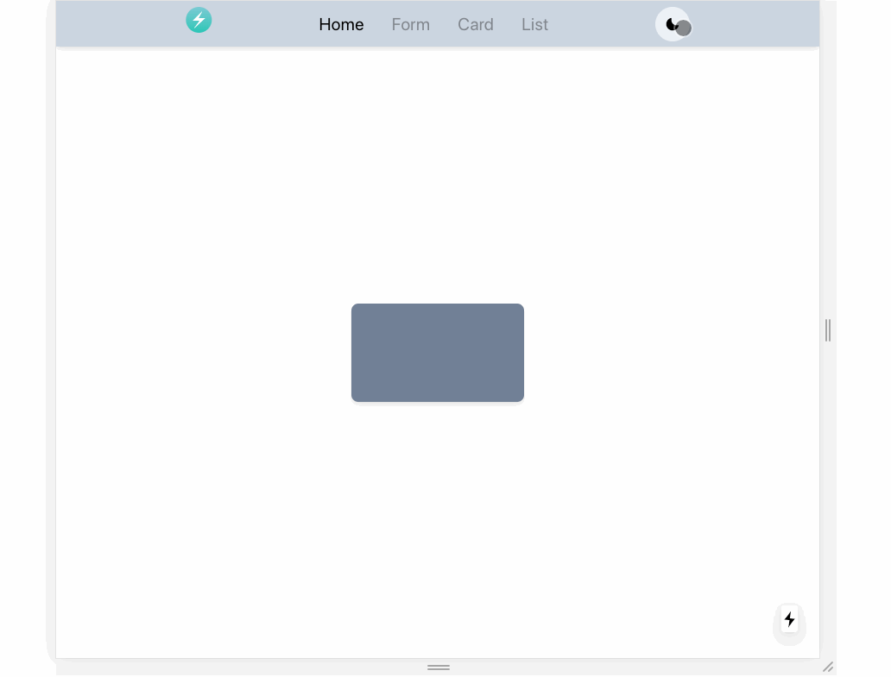

# chakra-ui demo



## Why is Chakra-UI special

- Based on Styled-systems! 👍
- Strongly typed components: Cleaner codebase! Rarely use CSS prop! 🤞
- Supports the use of themes out of the box!
- Supports Dark mode out of the box! 🌗

## Steps

- 元素可以使用 as 属性，类似 Semantic-UI
- 关于黑暗模式切换，真是一个骚操作

```js
const bgColor = { light: "gray.200", dark: "gray.700" };

<Box w="400px" rounded="20px" bg={bgColor[colorMode]} />
```

- 关于 Flex

```js
<Flex
  maxW='1000px' // 最大宽度1000px
  w={[
    '90vw', // base
    '90vw', // 480px+
    '90vw', // 768px+
    '70vw'  // 992px+
    ]}
  direction={[ // 这里对应 四个屏幕大小
    'column', 'column', 'row', 'row'
    ]}
/>
```
